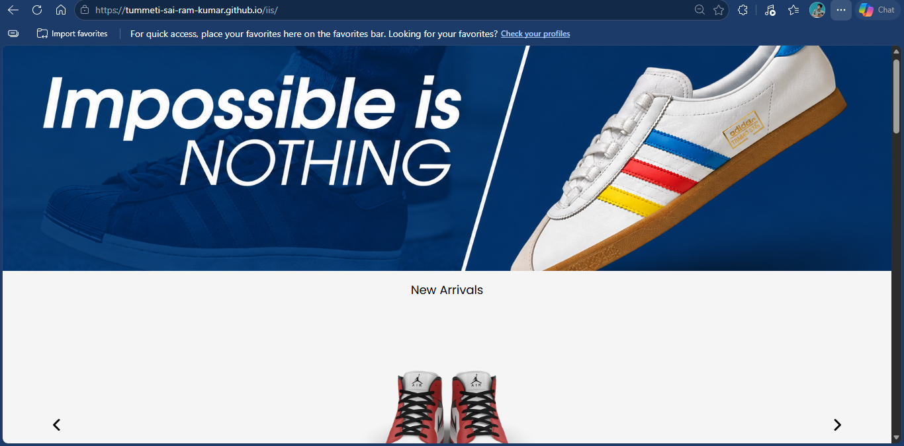
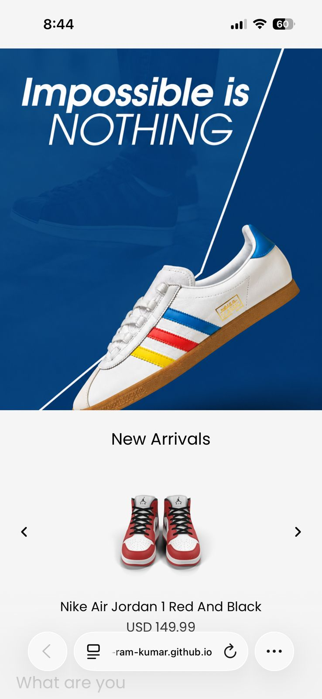

# iis Shop UI

A responsive sneaker shop UI built with **Vite**.

## 🚀 Project Setup

- Built with: **Vite**
- Required Node version: **22**

## ▶️ Run locally

1. Install dependencies:
   ```bash
   npm install
   ```
2. Start the development server:
   ```bash
   npm run dev
   ```

## 📱 Responsive support

This project is designed to work across mobile and desktop screen sizes.

### Project screenshots





> Add the two attached screenshots as `public/readme-image-1.png` and `public/readme-image-2.png` so they appear here.

## ✨ Features

- Responsive layout for small and large screens
- Product carousel / new arrivals section
- Cart interactions and product listing

## Phase II roadmap

- Add more products to the catalog
- Link the backend using **Node.js** and **Express.js**
- Improve performance with **lazy loading** and **code splitting**

## 💡 Notes

- Make sure you are using **Node 22** before running the project.
- The app is ready to deploy as a Vite production build.
